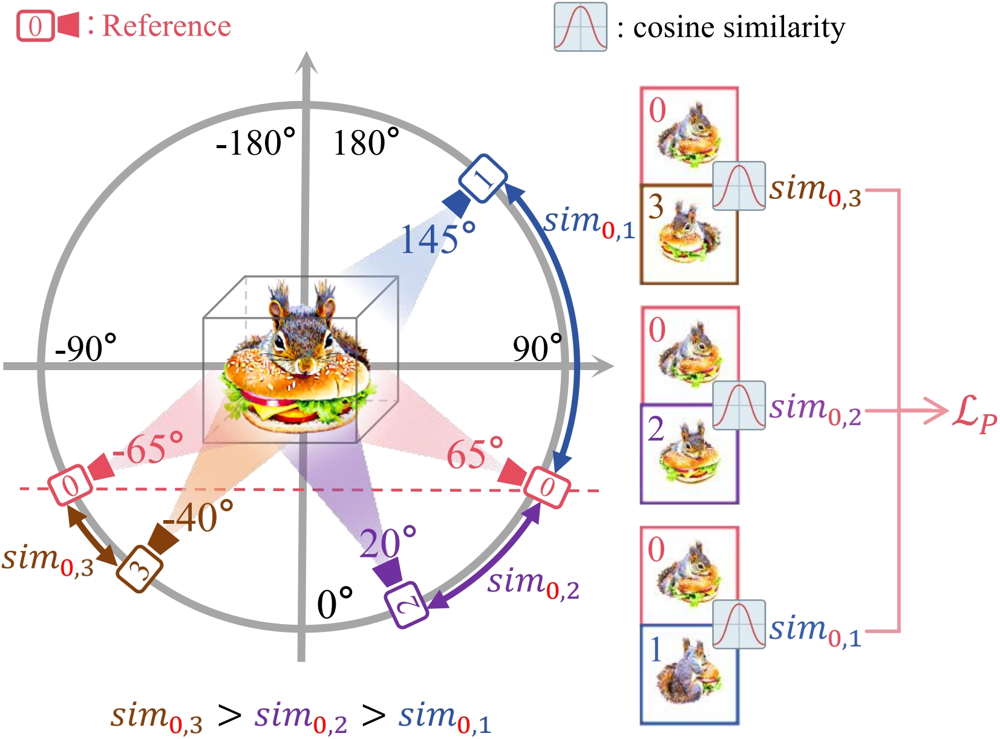
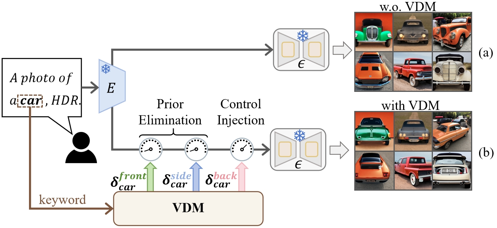

# ConsDreamer
ConsDreamer: Advancing Multi-View Consistency for Zero-Shot Text-to-3D Generation

    <!-- 左边大图（占60%） -->
    

        
    

    <!-- 右边两小图（占40%，垂直排列） -->
    

        
        
    

