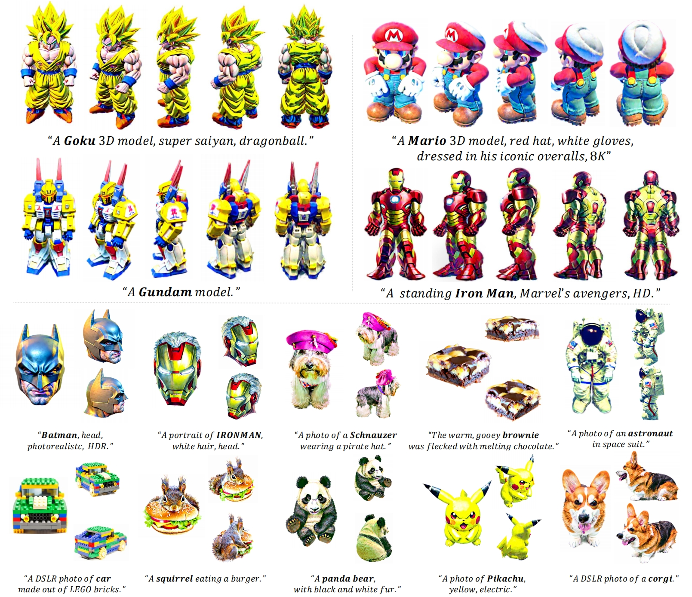
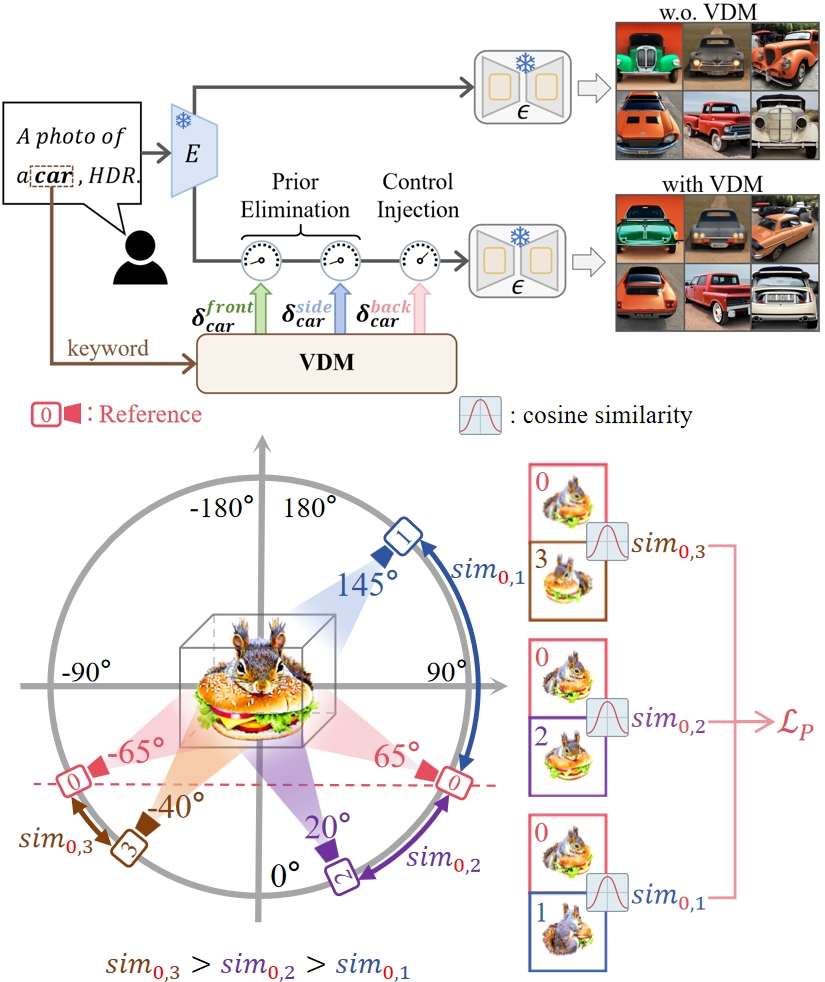

# ConsDreamer: Advancing Multi-View Consistency for Zero-Shot Text-to-3D Generation


<div align="center">
  
</div>

## Abstract
Here, we propose *ConsDreamer*, an innovative framework designed to address the Janus problem in text-to-3D generation by introducing: 1) a View Disentanglement Module and 2) a novel similarity-based partial order loss.
<details>
<summary>Click for the full abstract <b></b></summary>
Recent advances in zero-shot text-to-3D generation have revolutionized 3D content creation by enabling direct synthesis from textual descriptions. While state-of-the-art (SOTA) methods leverage 3D Gaussian Splatting with score distillation to enhance multi-view rendering through pre-trained T2I models, they suffer from inherent view biases in T2I priors that lead to inconsistent 3D generation, particularly manifesting as the multi-face Janus problem, where objects exhibit conflicting features across views.

To address this fundamental challenge, we propose **ConsDreamer**, a novel framework that mitigates view bias by refining both the conditional and unconditional terms in the score distillation process:
- **View Disentanglement Module (VDM)**: Eliminates viewpoint biases in conditional prompts by decoupling irrelevant view components and injecting precise camera parameters
- **Similarity-based partial order loss**: Enforces geometric consistency in the unconditional term by aligning cosine similarities with azimuth relationships

Extensive experiments validate that ConsDreamer effectively mitigates the multi-face Janus problem in text-to-3D generation, surpassing existing methods in both quality and consistency.
</details>

## Pipeline
<div align="center">
  
   
</div>

## Start
The implementation of **ConsDreamer** is mainly based on Python 3.9.16, [CUDA](https://developer.nvidia.com/cuda-toolkit-archive) 11.7 and [PyTorch](https://pytorch.org/) 2.0.1. To install all required dependencies:

### Cloning the Repository
The repository contains submodules; thus please check it out with
#### HTTPS
```
https://github.com/GAInuist/ConsDreamer.git
```
or
#### SSH
```
git@github.com:GAInuist/ConsDreamer.git
```

### Setup

#### Create conda environment
```
conda create -n ConsDreamer python=3.9.16 cudatoolkit=11.8
conda activate ConsDreamer
```

#### Running Environment
```
 pip install -r requirements.txt
 pip install submodules/diff-gaussian-rasterization/
 pip install submodules/simple-knn/
 cd CLIP_vit
 pip install -e .
```

## References
Parts of our codes based on:
* [EnVision-Research/LucidDreamer](https://github.com/EnVision-Research/LucidDreamer.git)    


